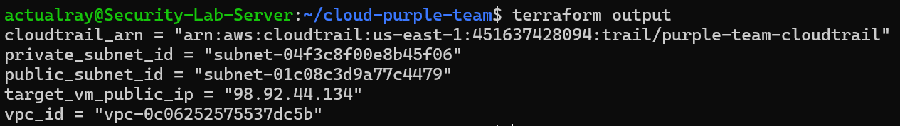
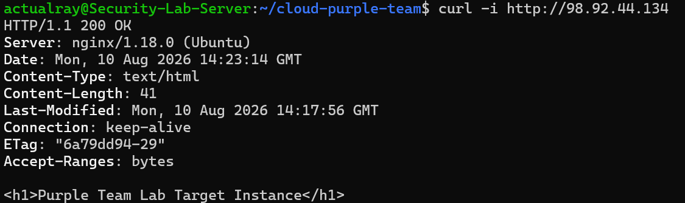
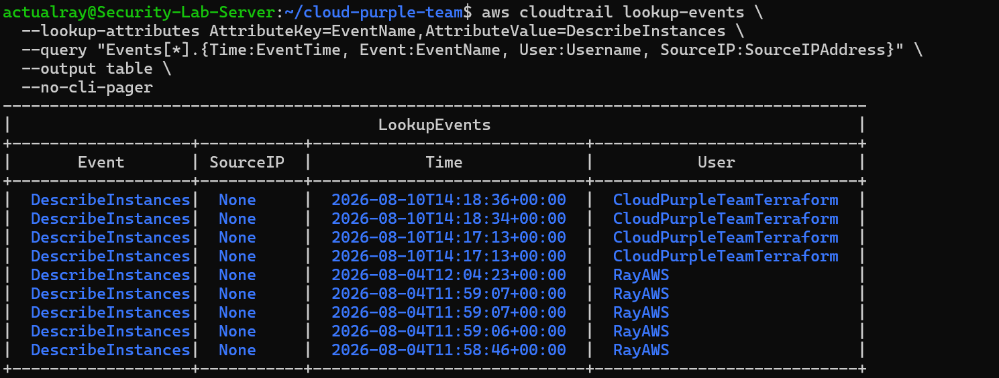
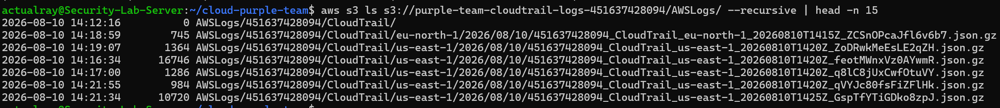
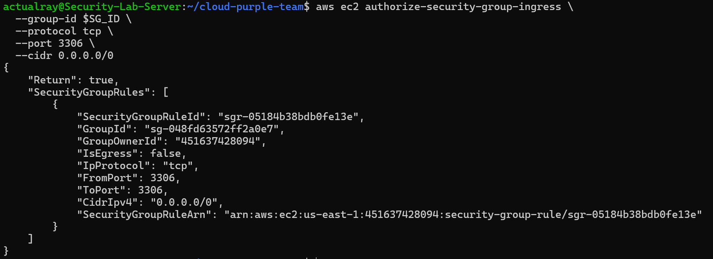
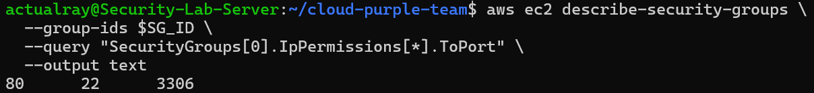
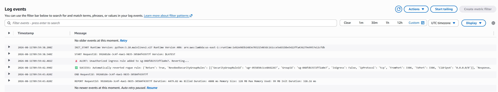
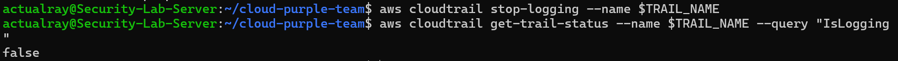
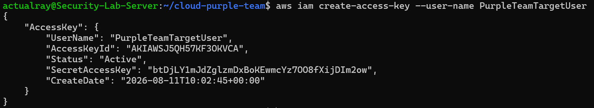

# AWS Cloud Security & Purple Team Automation Lab

I built this lab to get hands-on experience with Infrastructure as Code (IaC) and cloud security monitoring on AWS.

I started by building a small AWS environment with Terraform, then used it to simulate different security-related activities and see how they appeared from the Blue Team perspective. I later extended the lab with Amazon EventBridge and a Python Lambda function so that selected security events could trigger an automated response.

The overall goal was to understand the workflow from both sides:

**Red Team activity → CloudTrail telemetry → Detection → Investigation → Response**

---

## 🏗️ Architecture

The environment is structured around a custom VPC and an AWS logging and response pipeline.

* **Network:** Custom VPC (`10.0.0.0/16`) with public (`10.0.1.0/24`) and private (`10.0.2.0/24`) subnets behind an Internet Gateway.
* **Target Server:** Ubuntu 22.04 EC2 instance (`t3.micro`) automatically bootstrapped with Nginx using Terraform `user_data`.
* **Security Controls:** Security Groups controlling inbound access to the target.
* **Infrastructure:** Terraform manages the AWS resources so the lab can be recreated and destroyed when needed.
* **Logging:** Multi-region AWS CloudTrail records management-plane activity and delivers the logs to a locked-down S3 bucket.
* **Detection:** Amazon EventBridge filters selected CloudTrail events.
* **Response:** A Python/Boto3 AWS Lambda function automatically remediates a selected security-group change.

### Event Pipeline

```text
[ Red Team Activity / AWS CLI ]
              │
              ▼
       [ AWS CloudTrail ]
              │
              ▼
      [ Amazon EventBridge ]
              │
              ▼
         [ AWS Lambda ]
        Python / Boto3
              │
              ▼
      [ Target AWS Resource ]
```

---

## 🛠️ Tools Used

* **Infrastructure as Code:** Terraform
* **Cloud Platform:** AWS
* **Compute:** EC2, Lambda
* **Networking:** VPC, Subnets, Route Tables, Internet Gateway, Security Groups
* **Logging:** CloudTrail, S3
* **Event Detection:** EventBridge
* **Monitoring:** CloudWatch
* **Identity:** IAM
* **Target Services:** Nginx, Ubuntu 22.04 LTS
* **Programming:** Python, Boto3
* **CLI Tools:** AWS CLI, Bash
* **Security Framework:** MITRE ATT&CK

---

# 🔧 What I Did

## 1. Built the Infrastructure

I used Terraform to provision the AWS environment, including:

* VPC
* Public and private subnets
* Route tables
* Internet Gateway
* Security Groups
* EC2 instance
* Nginx
* S3 log bucket
* CloudTrail

The infrastructure could be created from scratch with Terraform rather than manually configuring each resource through the AWS console.

---

## 2. Built the Telemetry Baseline

I configured AWS CloudTrail to record management-plane API activity across regions and deliver the logs to an S3 bucket.

I verified that the CloudTrail `.json.gz` files were being delivered successfully and that the events contained information such as:

* API calls
* Timestamps
* Source IP addresses
* IAM identities
* Request parameters

This gave me a baseline for investigating activity performed against the environment.

---

## 3. Simulated Cloud Reconnaissance

I used the AWS CLI to perform basic reconnaissance against the environment.

For example:

```bash
aws ec2 describe-instances
```

This allowed me to see what kind of information could be obtained through AWS management-plane API calls and how that activity appeared in CloudTrail.

---

# 🔴 Security Scenarios

## Scenario A — Security Group Exposure & Automated Remediation

### Red Team Activity

I simulated an attacker gaining enough access to modify a security group and adding an unnecessary inbound rule exposing MySQL port `3306` to the internet:

```text
TCP 3306 → 0.0.0.0/0
```

The change was performed only against my own lab environment.

### Detection

The security-group modification generated an AWS API event:

```text
AuthorizeSecurityGroupIngress
```

CloudTrail recorded the event, including the affected security group and the request parameters.

I configured EventBridge to detect this type of activity and trigger my Lambda function.

### Automated Response

The Lambda function was written in Python using Boto3.

When triggered, it:

1. Reads the CloudTrail event.
2. Extracts the security-group ID.
3. Identifies the added IP permission.
4. Builds the corresponding Boto3 request.
5. Revokes the unwanted rule.
6. Logs the result to CloudWatch.

The function removes the specific rule instead of replacing the entire security-group configuration, so legitimate rules are left untouched.

### Result

The `3306` rule was automatically removed after the simulated change.

I verified the result by checking both the security-group configuration and the Lambda execution logs.

---

## Scenario B — Disabling CloudTrail

### Red Team Activity

For this scenario, I wanted to see what happens when an attacker tries to interfere with the system providing the security telemetry.

I temporarily stopped CloudTrail logging:

```bash
aws cloudtrail stop-logging
```

I then checked its status:

```bash
aws cloudtrail get-trail-status
```

The result showed:

```text
IsLogging: false
```

This demonstrated a simple but important problem: if an attacker is able to disable the telemetry source, the visibility provided by that source can be interrupted.

After the test, I manually restored CloudTrail logging because this was a controlled lab experiment.

### Result

The experiment successfully demonstrated the monitoring gap created when CloudTrail logging is disabled.

This scenario is currently a demonstration rather than a fully automated defense.

**MITRE ATT&CK:** T1685.002 — Disable or Modify Cloud Log

---

## Scenario C — IAM Persistence

### Red Team Activity

I also simulated an attacker attempting to establish persistent access to an IAM identity by creating a new set of long-term access keys for a test user.

The purpose was to investigate what this type of activity looks like from the Blue Team perspective.

### Investigation

I used CloudTrail to examine the resulting event and identify:

* The IAM identity involved
* The API call
* Timestamp
* Source IP
* Affected IAM resource

This gave me a practical example of how IAM activity can be investigated through AWS management-plane telemetry.

**MITRE ATT&CK:** T1098.001 — Additional Cloud Credentials

---

# 🐍 Automated Remediation

The automated response for Scenario A was implemented using AWS Lambda, Python, and Boto3.

The function parses the CloudTrail event and extracts the information required to revoke the specific security-group permission.

```python
import boto3

def lambda_handler(event, context):
    ec2 = boto3.client('ec2')
    detail = event.get('detail', {})
    
    if detail.get('eventName') == 'AuthorizeSecurityGroupIngress':
        group_id = detail['requestParameters']['groupId']
        items = detail['requestParameters']['ipPermissions']['items']
        
        print(f"ALERT: Unauthorized ingress rule added to {group_id}. Reverting...")
        
        for item in items:
            try:
                protocol = item.get('ipProtocol', '-1')
                from_port = item.get('fromPort')
                to_port = item.get('toPort')
                
                ip_ranges = [
                    {'CidrIp': r['cidrIp']} 
                    for r in item.get('ipRanges', {}).get('items', [])
                    if 'cidrIp' in r
                ]
                
                permission = {
                    'IpProtocol': str(protocol),
                    'IpRanges': ip_ranges
                }
                
                if from_port is not None:
                    permission['FromPort'] = int(from_port)
                
                if to_port is not None:
                    permission['ToPort'] = int(to_port)
                
                response = ec2.revoke_security_group_ingress(
                    GroupId=group_id,
                    IpPermissions=[permission]
                )
                
                print(f"SUCCESS: Automatically reverted rogue rule: {response}")
                return {"status": "success"}
                
            except Exception as e:
                print(f"ERROR: Failed to revert rule: {e}")
                return {
                    "status": "error",
                    "message": str(e)
                }
```

One part I had to pay attention to was the structure of the CloudTrail event. The information needed by the Lambda function was nested inside the request parameters, so the function had to extract it and convert it into the format expected by Boto3.

---

# 📸 Screenshots & Proof

The following screenshots document the main stages of the lab, from infrastructure deployment to security testing and automated remediation.

## 1. Terraform Infrastructure Provisioning

The AWS environment was successfully provisioned using Terraform.



---

## 2. Nginx Target Verification

The EC2 target was successfully bootstrapped with Nginx and returned a `200 OK` response.



---

## 3. Red Team AWS Reconnaissance

I used the AWS CLI to perform basic EC2 reconnaissance against the test environment.


---

## 4. CloudTrail Telemetry

The reconnaissance activity was recorded by CloudTrail with information such as the API call, IAM identity, source IP, and timestamp.



---

## 5. CloudTrail Logs in S3

The raw CloudTrail `.json.gz` files were successfully delivered to the dedicated S3 bucket.



---

## 6. Red Team Security Group Modification

I simulated an unauthorized security-group change by adding an inbound rule exposing TCP port `3306` to the public internet.



---

## 7. Automated Remediation Verification

The unauthorized security-group rule was automatically removed by the Lambda remediation function.



---

## 8. Lambda Execution Logs

CloudWatch logs show the Lambda function receiving the event and successfully executing the remediation logic.



---

## 9. CloudTrail Defense-Evasion Test

I simulated an attempt to blind the monitoring system by stopping CloudTrail logging.



**MITRE ATT&CK:** T1685.002 — Disable or Modify Cloud Log

---

## 10. IAM Persistence Test

I simulated persistence by creating an additional IAM access key for a test identity.



**MITRE ATT&CK:** T1098.001 — Additional Cloud Credentials

---

# 🎯 MITRE ATT&CK Coverage

Two of the simulated scenarios were mapped to specific MITRE ATT&CK techniques:

| Scenario                    | MITRE ATT&CK | Technique                    |
| --------------------------- | ------------ | ---------------------------- |
| CloudTrail logging disabled | T1685.002    | Disable or Modify Cloud Log  |
| IAM access-key creation     | T1098.001    | Additional Cloud Credentials |

The security-group scenario focuses on AWS security-group modification and automated remediation rather than forcing an ATT&CK technique mapping where the behavior does not cleanly correspond to one.

---

# 📚 What I Learned

This project helped me understand cloud security from a more practical perspective.

My earlier security projects focused mainly on network detection and SIEM/SOAR workflows. With this project, I wanted to understand how those ideas translate to AWS and cloud infrastructure.

One thing I found particularly useful was seeing how a relatively simple AWS action can produce a detailed CloudTrail event containing information that can later be used for investigation.

I also learned how EventBridge and Lambda can be combined to react to security-related activity without requiring a continuously running server.

The CloudTrail test also showed me the other side of monitoring: if the logging mechanism itself is disabled, the visibility it provides can disappear. That made the difference between simply collecting logs and actually designing a more resilient security monitoring system much clearer to me.

---

# ⚠️ Limitations

This project is a controlled personal lab rather than a production security system.

Some current limitations are:

* The attack scenarios are simulations performed against infrastructure under my control.
* CloudTrail provides management-plane telemetry and does not provide complete network-level visibility.
* The CloudTrail disabling scenario currently requires manual restoration.
* The IAM persistence scenario focuses on telemetry and investigation rather than automated credential removal.
* Automated remediation is currently implemented for the security-group scenario.

These limitations also give me clear areas to explore in future versions.

---

# 🔮 Future Improvements

Possible future improvements include:

* Automated detection and remediation for IAM credential creation
* Automated response to CloudTrail tampering
* GuardDuty integration
* Security Hub integration
* Additional cloud attack scenarios
* Privilege-escalation detection
* Centralized security dashboards
* Detection-latency measurements
* Integration with a SIEM/SOAR platform
* More detailed incident timelines

---

# 🧹 Teardown

Since the entire lab is managed through Terraform, I can remove the infrastructure after testing to avoid unnecessary AWS costs:

```bash
terraform destroy -auto-approve
```

This also makes the lab reproducible because I can provision the environment again whenever I want.

---

## Project Summary

The final version of this lab allowed me to work through a small but complete cloud-security workflow:

```text
Build Infrastructure
        ↓
Perform Controlled Security Activity
        ↓
Collect Cloud Telemetry
        ↓
Detect Activity
        ↓
Investigate Events
        ↓
Respond Automatically
        ↓
Verify the Result
```

The main thing I wanted to learn was not simply how to deploy AWS services, but how **cloud infrastructure, security telemetry, detection, investigation, and automated response fit together**.

