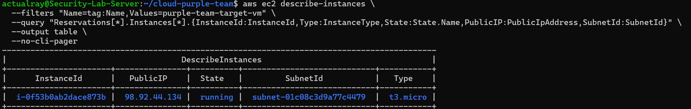

# AWS Cloud Security & Telemetry Lab

I built this lab to get hands-on experience with Infrastructure as Code (IaC) and cloud security monitoring on AWS. The goal was to provision a clean network setup, run basic Red Team reconnaissance against an EC2 target, and verify that Blue Team logging captures every API call in real time.

---

## Architecture

Here is how the environment is structured:

* **Network:** Custom VPC (`10.0.0.0/16`) with isolated public (`10.0.1.0/24`) and private (`10.0.2.0/24`) subnets behind an Internet Gateway.
* **Target Server:** An Ubuntu 22.04 EC2 instance (`t3.micro`) automatically bootstrapped with Nginx using Terraform `user_data`.
* **Security Controls:** Security Group limiting inbound access strictly to HTTP (Port 80) and SSH (Port 22).
* **Logging Pipeline:** Multi-region AWS CloudTrail forwarding all management plane events into a locked-down S3 bucket (public access blocked, bucket policies enforced).

---

## Tools Used

* **IaC:** Terraform
* **Cloud Platform:** AWS (EC2, VPC, CloudTrail, S3, IAM, Security Groups)
* **Target Services:** Nginx, Ubuntu 22.04 LTS
* **CLI Tools:** AWS CLI, Bash

---

## What I Did

1. **Built the Telemetry Baseline:** Wrote Terraform modules to spin up an S3 log bucket and configured CloudTrail to log API calls across all regions.
2. **Deployed the Network & Target:** Provisioned the VPC, subnets, route tables, and the Nginx EC2 target instance in a single deployment run.
3. **Simulated Red Team Reconnaissance:** Used the AWS CLI (`aws ec2 describe-instances`) to query target instance details and simulate initial cloud enumeration.
4. **Verified Blue Team Audit Logs:** Inspected CloudTrail telemetry in the console and confirmed that the raw `.json.gz` log files were successfully saved into the S3 bucket with full IAM and IP details.

---

## Screenshots & Proof

### 1. Terraform Infrastructure Provisioning
Successfully spun up all 12 AWS resources with Terraform outputs.


### 2. Nginx Target Verification
Confirmed the web target was bootstrapped and reachable via HTTP (`200 OK`).


### 3. Red Team API Reconnaissance
Executed discovery calls against the EC2 management plane using the AWS CLI.


### 4. CloudTrail Telemetry Capture
Verified that CloudTrail caught the API calls with exact timestamps, source IPs, and IAM identities.


### 5. S3 Log Delivery
Checked the dedicated S3 bucket to ensure raw CloudTrail logs were being delivered cleanly.


---

## Teardown

Since the entire lab is managed through Terraform, tearing everything down to avoid AWS costs took just one command:

```bash
terraform destroy -auto-approve
